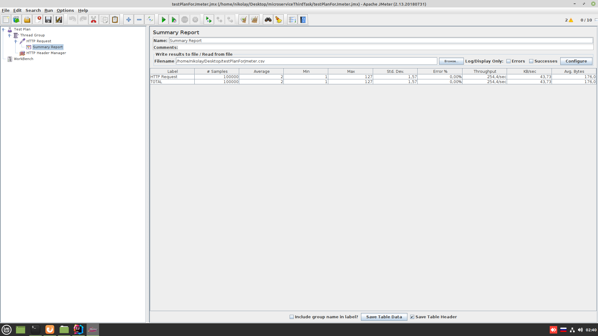
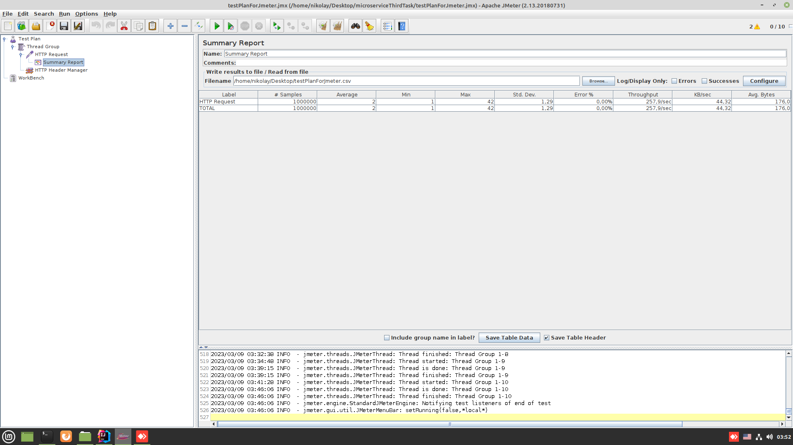

*Spring Boot REST приложение с использованием Docker Compose, Kafka, балансировщик нагрузки nginx и JMeter для нагрузочного тестирования*

# Задача 2

1. В архитектуру [Задачи 2 (https://github.com/ViarzilinMikalai/microserviceSecondTask)](https://github.com/ViarzilinMikalai/microserviceSecondTask) добавить балансировщик нагрузки nginx.
2. Увеличить количество приложений из пункта 1 [Задачи 2](https://github.com/ViarzilinMikalai/microserviceSecondTask) до трёх.
3. Стек: Java, Spring Boot, Kafka, Docker, Docker Compose, Jmeter, любая БД. 

### Порядок запуска проекта
Из папки docker, расположенной в корне проекта, выполнить команду docker-compose up -d

Результаты тестов (1000 запросов)

Результаты тестов (100к запросов)

Результаты тестов (1млн запросов)

