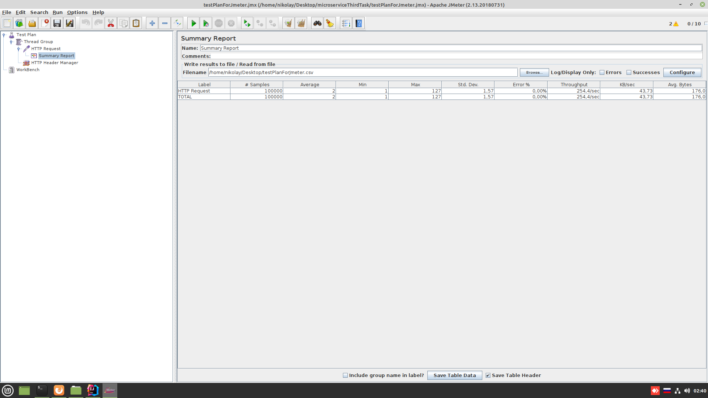
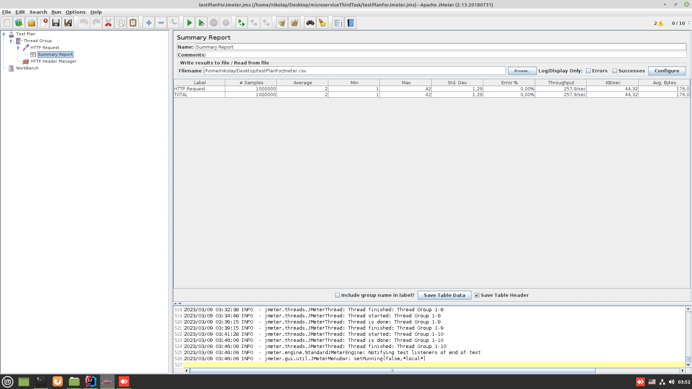

# Задача 2

1. В архитектуру [Задачи 2 (https://github.com/ViarzilinMikalai/microserviceSecondTask)](https://github.com/ViarzilinMikalai/microserviceSecondTask) добавить балансировщик нагрузки nginx.
2. Увеличить количество приложений из пункта 1 [Задачи 2](https://github.com/ViarzilinMikalai/microserviceSecondTask) до трёх.
3. Стек: Java/Kotlin, Spring Boot, Kafka, Docker, Docker Compose, Jmeter, любая БД.

###Порядок запуска проекта
1. **Перед стартом проекта необходимо отредактировать nginx.conf из папки docker**, расположенной в корне проекта. Для этого в разделе upstream my_number_app для каждого server нужно вместо IP 192.168.1.5 указать IP Вашего ПК (для Linux выполнить в терминале "ip -br a", для Windows выполнить в командной строке "ipconfig"). 
2. Затем в той же папке docker необходимо запустить на выполнение docker-compose.yml командой "docker-compose up -d".
3. Поочередно запустить файлы Application сначала для подпроектов myNumberProducerFirst, myNumberProducerSecond, myNumberProducerThird, затем для MyNumberConsumer.

Результаты тестов (1000 запросов)

Результаты тестов (100к запросов)

Результаты тестов (1млн запросов)
